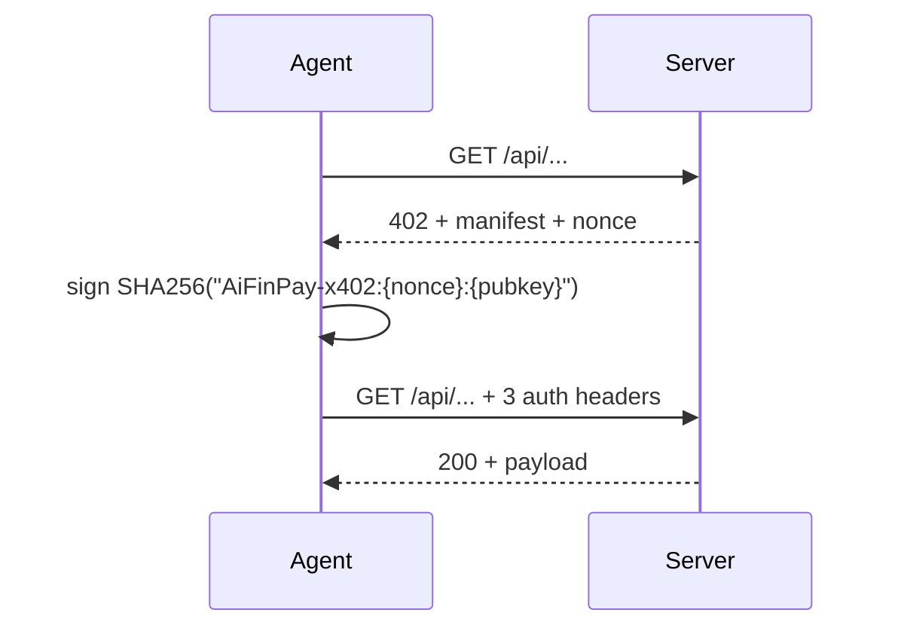

# AiFinPay — Payment Rail for AI Agents

[](https://www.npmjs.com/package/@aifinpay/agent)
[](https://www.npmjs.com/package/@aifinpay/mcp)
[](https://pypi.org/project/aifinpay-agent/)
[](./LICENSE)
[](https://aifinpay.company)
[](https://modelcontextprotocol.io)

**Stripe for autonomous AI agents.** One line of code — `agent.pay(url)` —
and your agent settles a real on-chain payment on Polygon or Solana
mainnet, then receives the gated response. Non-custodial. Live since
2026. Polygon facilitator compatible.

```bash
# Python
pip install aifinpay-agent --pre

# Node / TypeScript
npm install @aifinpay/agent@alpha

# MCP server (Claude Desktop, Cursor, Windsurf, Continue)
npx @aifinpay/mcp
```

## One-click MCP for Claude Desktop / Cursor

Drop this block into your client config — `claude_desktop_config.json`
(macOS: `~/Library/Application Support/Claude/claude_desktop_config.json`)
or Cursor's `~/.cursor/mcp.json`:

```json
{
  "mcpServers": {
    "aifinpay": {
      "command": "npx",
      "args": ["@aifinpay/mcp"]
    }
  }
}
```

Restart the client. Your model now has five payment tools
(`payable_fetch`, `agent_address`, `agent_quote`, `pay_with_split`,
`quote_split`) and can autonomously settle any x402-gated API.

Full client matrix (Claude Desktop, Cursor, Windsurf, Continue, LobeChat,
Cline) lives in [`MCP_CONFIG.md`](./MCP_CONFIG.md).

## Packages

| Package | Path | Install | Latest |
|---|---|---|---|
| **`aifinpay-agent`** (Python) | [`./python`](./python) | `pip install aifinpay-agent --pre` | `0.2.0a2` (alpha) |
| **`@aifinpay/agent`** (Node / TypeScript) | [`./node`](./node) | `npm install @aifinpay/agent@alpha` | `0.3.0-alpha.0` (alpha) |
| **`@aifinpay/mcp`** (MCP server) | [`./mcp`](./mcp) | `npx @aifinpay/mcp` | `0.1.0-alpha.2` (alpha) |
| Go SDK | — | `go get github.com/AiFinPay/sdk/go` | **soon** |
| Rust SDK | — | `cargo add aifinpay-sdk` | **soon** |

## What this is

`agent.pay(url)` — one line of Python or TypeScript that pays any
[x402-protected](https://www.x402.org) URL on behalf of an autonomous
AI agent. The SDK auto-detects the facilitator flavor (AiFinPay native,
Coinbase x402, …), signs an Ed25519 challenge, retries the request, and
returns the response.

Same agent, drop into Claude Desktop's MCP config and the LLM gets
five tools (`payable_fetch`, `agent_address`, `agent_quote`,
`pay_with_split`, `quote_split`) for autonomous payment loops.

## Quick start

### Python

```python
from aifinpay import Agent
agent = Agent.new()
print("Fund this address with MATIC:", agent.address)
print("Save this secret:", agent.secret_b58)

# Pay any x402-protected URL
resp = agent.pay("https://api.example.com/v1/data")

# Direct fee-on-top split — merchant gets 100% of merchant_amount;
# AiFinPay 1% on top.
invoice = agent.pay_with_split_invoice(
    chain="polygon",
    merchant_wallet="0xMerchant...",
    merchant_amount=10**18,
    order_id="search-1",
)
```

### Node.js / TypeScript

```ts
import { Agent } from "@aifinpay/agent";

const agent = Agent.new();
console.log("Fund this address:", agent.address);

const res = await agent.pay("https://api.example.com/v1/data");

const invoice = await agent.payWithSplitInvoice({
  chain: "polygon",
  merchantWallet: "0xMerchant...",
  merchantAmount: 10n ** 18n,
  orderId: "search-1",
});
```

### MCP (Claude Desktop)

```json
{
  "mcpServers": {
    "aifinpay": {
      "command": "npx",
      "args": ["@aifinpay/mcp"],
      "env": {
        "AIFINPAY_AGENT_SECRET": "<base58 secret>",
        "AIFINPAY_MAX_USD": "0.50"
      }
    }
  }
}
```

Restart Claude Desktop. The model now has five payment tools —
`payable_fetch(url)` lets it autonomously call any x402-gated API.

## How it works



For a partner who wants to **accept** AiFinPay payments, the simplest
integration is a single HTTP call to `aifinpay.company/api/seat/<pubkey>`
inside their existing API — no wallet, no chain library, no KYC. See
[`examples/echo-x402-server`](./examples/echo-x402-server) for a working
~70-line reference.

For full autonomy via fee-on-top atomic split (merchant gets 100% of
their quoted price, agent pays the fee on top), agents call
`b2bPayWithSplit()` on the `AiFinPaySplitter` Polygon contract:
`0xE34Fc0E6694821c600Fa0955C0F74720ea6d8440` — owned by Gnosis Safe
`0xD31d82c4b35DABaA2ad7023C89A78A052D1f3c8e` (4-of-N).

## Live contract addresses

All verified on Polygonscan.

| | Polygon (mainnet) |
|---|---|
| `AiFinPayCore` | [`0x24Bee0df…1C7b`](https://polygonscan.com/address/0x24Bee0dfCD4d2f481E2f49A339F1C105a1611C7b) |
| `AgentPassport` | [`0xB385Cc32…662a`](https://polygonscan.com/address/0xB385Cc32fe39CF5B5778DF0Df0e8E9978b5F662a) |
| `MSECCOToken` | [`0x1Fe20213…1d55`](https://polygonscan.com/address/0x1Fe2021336596655Fac72bC7bC40F7FFFA501d55) |
| **`AiFinPaySplitter`** | [`0xE34Fc0E6…8440`](https://polygonscan.com/address/0xE34Fc0E6694821c600Fa0955C0F74720ea6d8440) |
| Gnosis Safe (multisig owner) | [`0xD31d82c4…3c8e`](https://polygonscan.com/address/0xD31d82c4b35DABaA2ad7023C89A78A052D1f3c8e) |

Solana program (Anchor): `5g9zWHF1Vv6GiGpA2ZbJQbSCDZd5hAk9AyvabRJvKFx2`.

## Framework integrations

Drop-in adapters for popular agent frameworks live under
[`./examples/`](./examples). Each is a working, paste-and-run example.

| Framework | Example | What it shows |
|---|---|---|
| **OpenAI Agents SDK** | [`examples/openai-agent`](./examples/openai-agent) | `Tool`-style integration: GPT-4 calls a tool that pays an x402 endpoint and returns the response |
| **Claude (MCP)** | [`examples/claude-mcp`](./examples/claude-mcp) | Zero-code: just install the MCP server, talk to Claude |
| **LangChain** | [`examples/langchain`](./examples/langchain) | `BaseTool` wrapping `agent.pay()` |
| **CrewAI** | [`examples/crewai`](./examples/crewai) | A research crew that buys inference and search calls as it works |
| **Flowise** | [`examples/flowise`](./examples/flowise) | Custom node JSON + import instructions |
| **AutoGPT / AutoGen** | [`examples/autogpt`](./examples/autogpt) | Headless agent loop that funds itself once, then runs unattended |
| Reference partner server | [`examples/echo-x402-server`](./examples/echo-x402-server) | ~70-line Node server that accepts AiFinPay payments |
| Live bridges | [`examples/io-net-x402-bridge`](./examples/io-net-x402-bridge), [`exa-x402-bridge`](./examples/exa-x402-bridge), [`venice-x402-bridge`](./examples/venice-x402-bridge) | Production bridges in front of io.net / Exa / Venice |

## Verified mainnet payments

Two on-chain proofs that the full stack works end-to-end:

| Provider | Asset | What was bought | Tx |
|---|---|---|---|
| Exa Search | POL | First SDK call via Exa | [`0xeb13c5ed…59c8700`](https://polygonscan.com/tx/0xeb13c5ed59c8700) |
| io.net | POL | Llama-3.3-70B inference, $0.025 | [`0x7c6ca0ff…129f0a`](https://polygonscan.com/tx/0x7c6ca0ff129f0a) |

## Repo layout

```
sdk/
├── python/                  aifinpay-agent (PyPI)
├── node/                    @aifinpay/agent (npm)
├── mcp/                     @aifinpay/mcp (npm)
├── docs/                    QUICKSTART.md, MCP_CONFIG.md, integrations
└── examples/
    ├── openai-agent/        OpenAI Agents SDK tool
    ├── claude-mcp/          Claude Desktop MCP config + walkthrough
    ├── langchain/           LangChain BaseTool wrapper
    ├── crewai/              CrewAI multi-agent crew that pays
    ├── flowise/             Flowise custom node
    ├── autogpt/             Headless self-funding agent loop
    ├── echo-x402-server/    reference partner integration (~70 lines)
    ├── io-net-x402-bridge/  live io.net bridge
    ├── exa-x402-bridge/     live Exa bridge
    └── venice-x402-bridge/  live Venice bridge
```

## Releasing

Each package version-bumps independently. Both registries get prerelease
tags so production users only see stable when explicitly opt-in.

```bash
# Python
cd python
python -m build
python -m twine upload --repository pypi dist/*

# Node
cd ../node
npm run build
npm publish --tag alpha

# MCP
cd ../mcp
npm install                 # so it can resolve @aifinpay/agent
npm run build
npm publish --tag alpha
```

## Contributing

Issues and PRs welcome. For protocol-level changes, please open an
issue first to discuss.

## License

MIT — see [LICENSE](./LICENSE).

## Links

- Site: https://aifinpay.company
- Docs: https://aifinpay.company/docs
- Manifesto: https://aifinpay.company/manifesto.json
- x402 protocol: https://www.x402.org
- MCP spec: https://modelcontextprotocol.io
