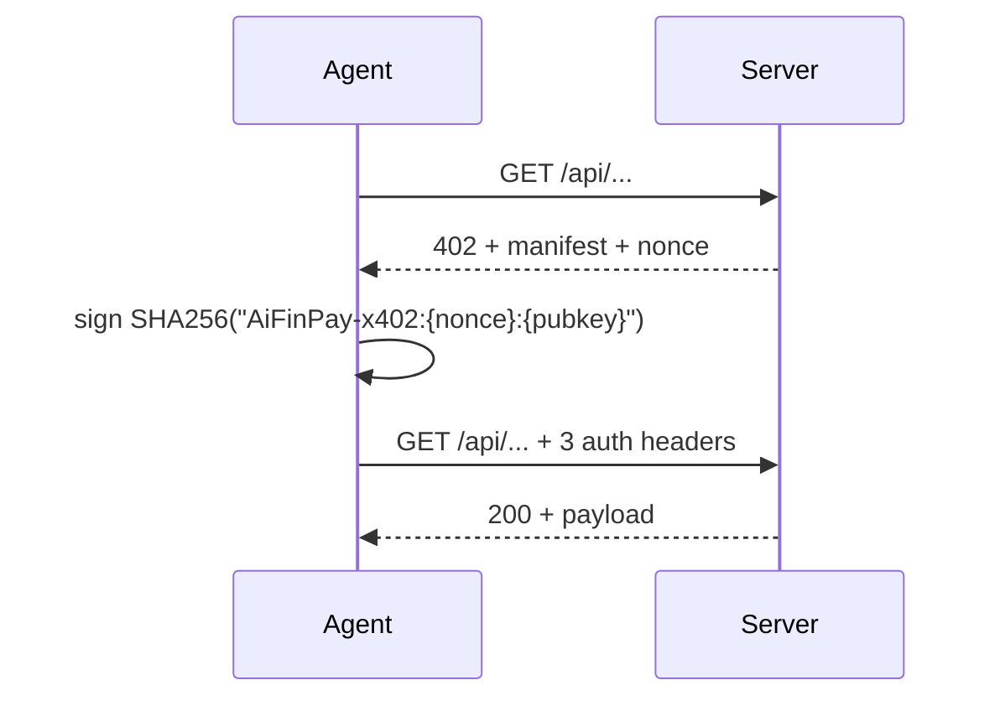

# AiFinPay SDKs

Public monorepo for **AiFinPay** — the autonomous payment layer for AI
agents. Live at **[aifinpay.company](https://aifinpay.company)**.

This repo holds the agent-side SDKs, the MCP server, and reference
partner integrations. The protocol backend (the live `aifinpay.company`
service) lives in a private operator repo.

## Packages

| Package | Path | Install | Latest |
|---|---|---|---|
| **`aifinpay-agent`** (Python) | [`./python`](./python) | `pip install aifinpay-agent --pre` | `0.2.0a2` (alpha) |
| **`@aifinpay/agent`** (Node / TypeScript) | [`./node`](./node) | `npm install @aifinpay/agent@alpha` | `0.2.0-alpha.2` (alpha) |
| **`@aifinpay/mcp`** (MCP server for Claude Desktop / agent runtimes) | [`./mcp`](./mcp) | `npx @aifinpay/mcp` | `0.1.0-alpha.2` (alpha) |
| Go SDK | — | `go get github.com/AiFinPay/sdk/go` | **soon** |
| Rust SDK | — | `cargo add aifinpay-sdk` | **soon** |

## What this is

`agent.pay(url)` — one line of Python or TypeScript that pays any
[x402-protected](https://www.x402.org) URL on behalf of an autonomous
AI agent. The SDK auto-detects the facilitator flavor (AiFinPay native,
Coinbase x402, …), signs an Ed25519 challenge, retries the request, and
returns the response.

Same agent, drop into Claude Desktop's MCP config and the LLM gets
five tools (`payable_fetch`, `agent_address`, `agent_quote`,
`pay_with_split`, `quote_split`) for autonomous payment loops.

## Quick start

### Python

```python
from aifinpay import Agent
agent = Agent.new()
print("Fund this address with MATIC:", agent.address)
print("Save this secret:", agent.secret_b58)

# Pay any x402-protected URL
resp = agent.pay("https://api.example.com/v1/data")

# Direct fee-on-top split — merchant gets 100% of merchant_amount;
# AiFinPay 1% on top.
invoice = agent.pay_with_split_invoice(
    chain="polygon",
    merchant_wallet="0xMerchant...",
    merchant_amount=10**18,
    order_id="search-1",
)
```

### Node.js / TypeScript

```ts
import { Agent } from "@aifinpay/agent";

const agent = Agent.new();
console.log("Fund this address:", agent.address);

const res = await agent.pay("https://api.example.com/v1/data");

const invoice = await agent.payWithSplitInvoice({
  chain: "polygon",
  merchantWallet: "0xMerchant...",
  merchantAmount: 10n ** 18n,
  orderId: "search-1",
});
```

### MCP (Claude Desktop)

```json
{
  "mcpServers": {
    "aifinpay": {
      "command": "npx",
      "args": ["@aifinpay/mcp"],
      "env": {
        "AIFINPAY_AGENT_SECRET": "<base58 secret>",
        "AIFINPAY_MAX_USD": "0.50"
      }
    }
  }
}
```

Restart Claude Desktop. The model now has five payment tools —
`payable_fetch(url)` lets it autonomously call any x402-gated API.

## How it works



For a partner who wants to **accept** AiFinPay payments, the simplest
integration is a single HTTP call to `aifinpay.company/api/seat/<pubkey>`
inside their existing API — no wallet, no chain library, no KYC. See
[`examples/echo-x402-server`](./examples/echo-x402-server) for a working
~70-line reference.

For full autonomy via fee-on-top atomic split (merchant gets 100% of
their quoted price, agent pays the fee on top), agents call
`b2bPayWithSplit()` on the `AiFinPaySplitter` Polygon contract:
`0xE34Fc0E6694821c600Fa0955C0F74720ea6d8440` — owned by Gnosis Safe
`0xD31d82c4b35DABaA2ad7023C89A78A052D1f3c8e` (4-of-N).

## Live contract addresses

All verified on Polygonscan.

| | Polygon (mainnet) |
|---|---|
| `AiFinPayCore` | [`0x8Ad9830D…f4BAD`](https://polygonscan.com/address/0x8Ad9830D16b1f10333866a3f38C949CbB19f4BAD) |
| `AgentPassport` | [`0x66fFe91e…2185`](https://polygonscan.com/address/0x66fFe91eE0B80f386EB07F97354e2889CD162185) |
| `MSECCOToken` | [`0x83936231…182B`](https://polygonscan.com/address/0x83936231c80fdF17eC2786BD7DcF09014552182B) |
| **`AiFinPaySplitter`** | [`0xE34Fc0E6…8440`](https://polygonscan.com/address/0xE34Fc0E6694821c600Fa0955C0F74720ea6d8440) |
| Gnosis Safe (multisig owner) | [`0xD31d82c4…3c8e`](https://polygonscan.com/address/0xD31d82c4b35DABaA2ad7023C89A78A052D1f3c8e) |

Solana program (Anchor): `5g9zWHF1Vv6GiGpA2ZbJQbSCDZd5hAk9AyvabRJvKFx2`.

## Repo layout

```
sdk/
├── python/                  aifinpay-agent (PyPI)
├── node/                    @aifinpay/agent (npm)
├── mcp/                     @aifinpay/mcp (npm)
└── examples/
    └── echo-x402-server/    reference partner integration (~70 lines)
```

## Releasing

Each package version-bumps independently. Both registries get prerelease
tags so production users only see stable when explicitly opt-in.

```bash
# Python
cd python
python -m build
python -m twine upload --repository pypi dist/*

# Node
cd ../node
npm run build
npm publish --tag alpha

# MCP
cd ../mcp
npm install                 # so it can resolve @aifinpay/agent
npm run build
npm publish --tag alpha
```

## Contributing

Issues and PRs welcome. For protocol-level changes, please open an
issue first to discuss.

## License

MIT — see [LICENSE](./LICENSE).

## Links

- Site: https://aifinpay.company
- Docs: https://aifinpay.company/docs
- Manifesto: https://aifinpay.company/manifesto.json
- x402 protocol: https://www.x402.org
- MCP spec: https://modelcontextprotocol.io
