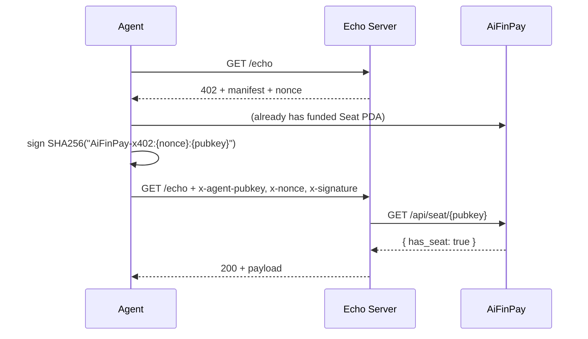

# echo-x402-server — reference AiFinPay-gated API

Demonstrates how a third-party AI service can charge AI agents per call
using **AiFinPay** as the payment + identity layer — in **~70 lines** of
Express. The service has no wallet, no blockchain RPC, no KYC; it leans
on AiFinPay for everything except its own business logic.

## Why this exists

The autonomous AI agent commerce loop needs one thing to be cheap:
**partner integration**. If you run an AI service (search, inference,
data, …) and want to accept payment from autonomous agents, this
repo is the smallest workable template.



## Run it

```bash
npm install
node server.js
# → "echo-x402 x402-gated API on port 3000"

# Probe (no auth) — get a 402 challenge
curl -s http://localhost:3000/echo | jq .

# Discovery
curl -s http://localhost:3000/.well-known/x402.json | jq .
```

## Test with the AiFinPay SDK

```bash
npm install @aifinpay/agent@alpha
node test-client.js
```

Two paths are demonstrated:
1. **Raw fetch** — manual nonce/sign/retry. Educational; ~25 lines.
2. **`agent.pay(url)` via the SDK** — same flow, **one line of payment code**.

Both end in 402 when the test agent has no funded Seat (which is the
correct behavior — the protocol is doing its job). When run with an
already-funded agent (load via `Agent.fromSecretB58(...)`), both end in
200 with the echoed message.

## Configuration

| Env | Default | Purpose |
|---|---|---|
| `PORT` | `3000` | Listen port |
| `AIFINPAY_API` | `https://aifinpay.company` | Where Seat PDA verification happens |
| `PRICE_USD` | `0.001` | Quoted price per call (cosmetic — gate is binary today) |
| `SERVICE_NAME` | `echo-x402` | Branding in 402 + 200 responses |

## What this proves

- A third-party AI service can integrate AiFinPay in **one HTTP call**
  (`GET /api/seat/:pubkey`) — no wallet, no RPC, no chain library.
- The 402 / sign / retry handshake is not vendor-locked: any HTTP server
  that returns the right manifest can accept agent payments via the
  shared SDK.
- AiFinPay's role is identity + payment proof; the partner keeps full
  control of their business logic.

## Production hardening checklist

This is a reference example. For mainnet revenue, you'd want:
- [ ] Replace in-memory nonce store with Redis / KV (so multi-replica
      deployments share state).
- [ ] Cache Seat PDA lookups (15-30s) to absorb traffic.
- [ ] Per-pubkey rate limit independent of the nonce gate.
- [ ] Per-call invoicing if you want analytics tied to AiFinPay (POST
      to your own analytics).
- [ ] Treasury rotation strategy (this template has no treasury — payment
      already settled at AiFinPay before the agent reaches you).
- [ ] Webhook subscription for "agent topped up" events when AiFinPay
      ships them.

## License

MIT.
